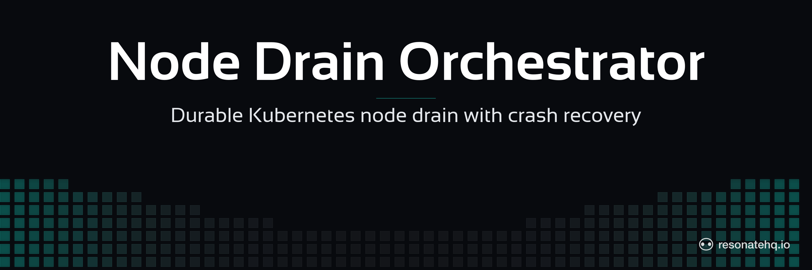

<p align="center">
  <picture>
    <source media="(prefers-color-scheme: dark)" srcset="./assets/banner-dark.png">
    <source media="(prefers-color-scheme: light)" srcset="./assets/banner-light.png">
    
  </picture>
</p>

# Kubernetes Node Drain Orchestrator | Resonate Go SDK

A durable Kubernetes node-drain orchestrator: cordon each worker node, evict its pods respecting Pod Disruption Budgets, and — when a PDB blocks eviction — pause and wait for an operator decision. Progress is checkpointed on a Resonate server, so a crash mid-drain resumes exactly where it left off instead of leaving the cluster in an unknown state.

> Heads up — `resonate-sdk-go` is pre-release. The SDK has no semver tag yet, so this example pins to a specific commit. Expect API changes until `v0.1.0`. See [Notes on the prerelease SDK](#notes-on-the-prerelease-sdk) for one rough edge this example works around.

## What this demonstrates

- **Crash recovery** — kill the worker mid-drain and restart it; the workflow resumes from the last checkpoint, not from scratch.
- **Checkpointed steps** — each node drain is a durable `ctx.Run` step; completed drains are never repeated on replay.
- **Human-in-the-loop** — when a PDB blocks eviction, the workflow creates a latent durable promise (`ctx.Promise`) and parks on it until a separate gateway process resolves the operator's decision.
- **Worker / gateway split across two processes** — the worker runs the workflow; the gateway is an HTTP control plane that starts operations and resolves decisions. State lives on the server, not in either process's memory.

## The code

```go
// drain/orchestrator.go (excerpt)
func (o *Orchestrator) DrainAllNodes(ctx *resonate.Context, args Args) (Result, error) {
    nodesF, _ := ctx.Run(o.getNodes, getNodesArgs{NodeSelector: args.NodeSelector})
    var nodes []k8s.NodeInfo
    _ = nodesF.Await(&nodes)

    for _, node := range nodes {
        res, _ := o.drainNode(ctx, node.Name, args.Options) // checkpointed ctx.Run

        if res.Success || args.Options.Force {
            continue
        }

        // Blocked by a PDB: create a latent promise and suspend until a human
        // resolves it through the gateway. Survives any number of crashes.
        decisionF, _ := ctx.Promise()
        log.Printf("[drain] node %s blocked — resolve promise %q", node.Name, decisionF.ID())

        var decision Decision
        _ = decisionF.Await(&decision) // skip | retry | abort | force
        // ... act on the decision ...
    }
}
```

## Architecture

```
┌──────────────────────────────────────────────────────────┐
│                      Resonate Server                       │
│                     (localhost:8001)                       │
└──────────────────────────────────────────────────────────┘
              │                            │
              ▼                            ▼
┌──────────────────────┐      ┌──────────────────────────┐
│   Worker (default    │      │  Gateway (drain-gateway   │
│   group)             │      │  group, HTTP :3000)       │
│                      │      │                           │
│  registers           │      │  POST /drain   → r.RPC    │
│  drainAllNodes;       │      │  GET  /status  → Get      │
│  runs the workflow   │      │  POST /skip/:id → Settle  │
└──────────────────────┘      └──────────────────────────┘
              │
              ▼
┌──────────────────────────────────────────────────────────┐
│                  Kind cluster (3 nodes)                    │
│   control-plane  +  worker-1  +  worker-2                  │
└──────────────────────────────────────────────────────────┘
```

The worker and gateway run in **different Resonate groups**. The gateway only creates and settles promises — it registers no functions — so it must not share the worker's group. If it did, the server would round-robin workflow task dispatches to the gateway, which would drop them, intermittently stalling the workflow.

## Prerequisites

- Go 1.22+
- [Kind](https://kind.sigs.k8s.io/) and [kubectl](https://kubernetes.io/docs/tasks/tools/) — a local Kubernetes cluster in Docker
- The `resonate` server CLI. Install with Homebrew on macOS or Linux:
  ```sh
  brew install resonatehq/tap/resonate
  ```
  Other install paths: <https://docs.resonatehq.io/get-started/install>.

## Setup

```sh
git clone https://github.com/resonatehq-examples/example-node-drain-orchestrator-go.git
cd example-node-drain-orchestrator-go
go mod download
```

Create a 3-node Kind cluster (1 control plane + 2 workers) and deploy the test workloads:

```sh
./scripts/setup-cluster.sh
./scripts/deploy-workloads.sh
```

The workloads set up the scenarios this example exercises:

- `simple-app` (4 replicas) — no PDB, drains cleanly
- `pdb-protected-app` (3 replicas) — PDB allows one disruption
- `critical-app` (2 replicas) — **blocking PDB** (`minAvailable: 2`), the human-in-the-loop trigger
- `long-running-job` — 5-minute termination grace period
- `node-monitor` — a DaemonSet (skipped by the drain)

## Run it

Start the dev server (terminal 1):

```sh
resonate dev
```

Start the worker (terminal 2) and the gateway (terminal 3):

```sh
go run ./cmd/worker
go run ./cmd/gateway
```

Trigger a drain (terminal 4):

```sh
curl -X POST http://localhost:3000/drain
curl http://localhost:3000/status
```

## What to look for

When the drain reaches `critical-app`, its blocking PDB rejects every eviction and the worker logs the decision promise:

```
[drain] node drain-demo-worker blocked — resolve promise "drain-...." with skip|retry|abort|force
```

Copy that promise ID and resolve it through the gateway:

```sh
curl -X POST http://localhost:3000/skip/<promise-id>     # move past this node
curl -X POST http://localhost:3000/force/<promise-id>    # bypass the PDB, force-delete pods
curl -X POST http://localhost:3000/abort/<promise-id>    # stop the operation
curl -X POST http://localhost:3000/retry/<promise-id>    # re-run the drain as-is
# or, with a JSON body:
curl -X POST http://localhost:3000/decision -H 'content-type: application/json' \
  -d '{"decision":"skip","promiseId":"<promise-id>"}'
```

The workflow resumes the instant the promise settles. To see crash recovery, kill the worker (Ctrl-C) mid-drain and restart it with `go run ./cmd/worker` — it picks up from the last checkpoint. On the dashboard at <http://localhost:8001> the operation is one root promise (`drain-<timestamp>`) with a child promise per checkpointed step.

## API reference

| Endpoint                 | Method | Description                                       |
| ------------------------ | ------ | ------------------------------------------------- |
| `/health`                | GET    | Health check                                      |
| `/status`                | GET    | Status of the most recent operation               |
| `/status/{operationId}`  | GET    | Status of a specific operation                    |
| `/drain`                 | POST   | Start a drain (`{options?, nodeSelector?}`)       |
| `/decision`              | POST   | Resolve a block (`{decision, promiseId}`)         |
| `/skip,/retry,/abort,/force` `/{promiseId}` | POST | Resolve a block with a fixed decision |
| `/operation`             | DELETE | Clear the in-process operation-ID tracker (for testing/reset) |

The `promiseId` is printed in the worker logs when a node blocks.

`POST /drain` accepts an optional body; omit it to use the defaults:

```json
{
  "options": {
    "evictionTimeoutMs": 60000,
    "drainTimeoutMs": 300000,
    "ignoreDaemonSets": true,
    "deleteLocalData": true,
    "force": false,
    "gracePeriodSeconds": 30
  },
  "nodeSelector": { "drain-target": "true" }
}
```

## File structure

```
example-node-drain-orchestrator-go/
├── drain/
│   ├── orchestrator.go   workflow + checkpointed steps (DrainAllNodes, drainSingleNode, getNodes)
│   ├── types.go          options, args, results, decision enum, shared constants
│   └── register_test.go  compile-time step-signature guards + a localnet Register check
├── internal/k8s/
│   └── k8s.go            client-go wrappers (cordon, evict, delete, wait loops)
├── cmd/
│   ├── worker/main.go    registers drainAllNodes, joins the default group, blocks on signal
│   └── gateway/main.go   net/http control plane; distinct group; RPC start + Get status + Settle decision
├── kind-config.yaml      3-node Kind cluster
├── test-workloads.yaml   drain scenarios (incl. the blocking PDB)
├── scripts/              setup-cluster / deploy-workloads / cleanup
├── go.mod                module declaration + SDK pin
├── assets/               README banner images
├── LICENSE               Apache-2.0
└── README.md
```

## Notes on the prerelease SDK

The gateway resolves the decision promise through the low-level `r.Sender().PromiseSettle`, encoding the value as JSON → base64 → quoted string by hand (see `encodeSettleValue` in `cmd/gateway/main.go`). The Go SDK does not yet expose a high-level `r.Promises().Resolve(id, value)` helper that folds the encoding and the settle call together ([resonate-sdk-go#28](https://github.com/resonatehq/resonate-sdk-go/issues/28)). One footgun to know: `resonate.NewValue(v)` is **not** the right call for a settle value — it stores raw JSON without the base64 wrap, which surfaces only later as a decode error on the worker side.

## Cleanup

```sh
./scripts/cleanup.sh
```

## Next steps

- [Human-in-the-loop](https://docs.resonatehq.io/get-started/examples/human-in-the-loop) — the pattern behind the blocked-drain pause.
- [Durable promises](https://docs.resonatehq.io/concepts/durable-promises) — how checkpointed steps survive crashes.
- [Go SDK reference](https://docs.resonatehq.io/develop/go) — installation and the full client/context API.

## Community

- Discord: <https://resonatehq.io/discord>
- X: <https://x.com/resonatehqio>
- LinkedIn: <https://linkedin.com/company/resonatehq>
- YouTube: <https://youtube.com/@resonatehq>
- Journal: <https://journal.resonatehq.io>

## License

[Apache-2.0](./LICENSE)
